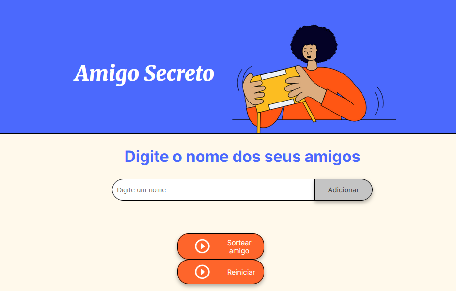

# Challenge Amigo Secreto 🎁

Projeto desenvolvido como parte do programa Oracle Next Education (ONE) em parceria com a Alura.

## 📸 

## 🧠 Descrição
Aplicação web para sorteio de amigo secreto que permite adicionar nomes, realizar sorteio de um amigo e reiniciar a lista. Desenvolvido com foco em lógica de programação utilizando JavaScript.

## 🛠️ Tecnologias
- HTML
- CSS
- JavaScript

## 🚀 Funcionalidades
- Adição de nomes com validação
- Sorteio aleatório
- Reinício da lista
- Interface responsiva e estilizada

## 📂 Como executar
Basta abrir o arquivo `index.html` em seu navegador.

---

Desenvolvido com 💜 por Iasmin
